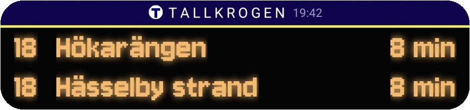
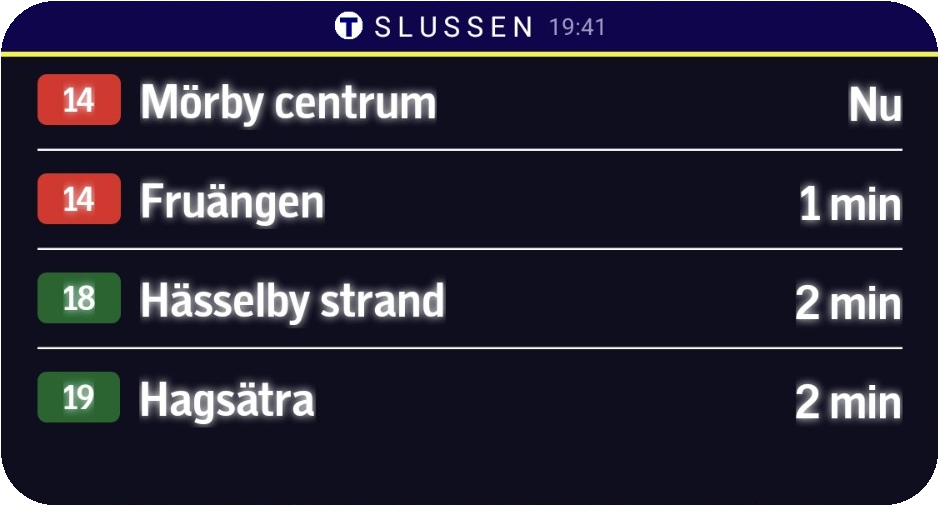
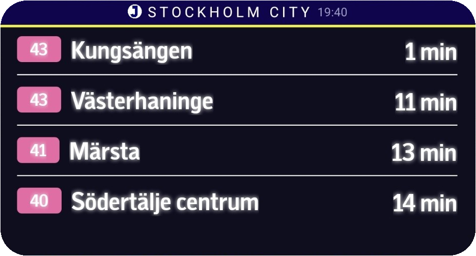
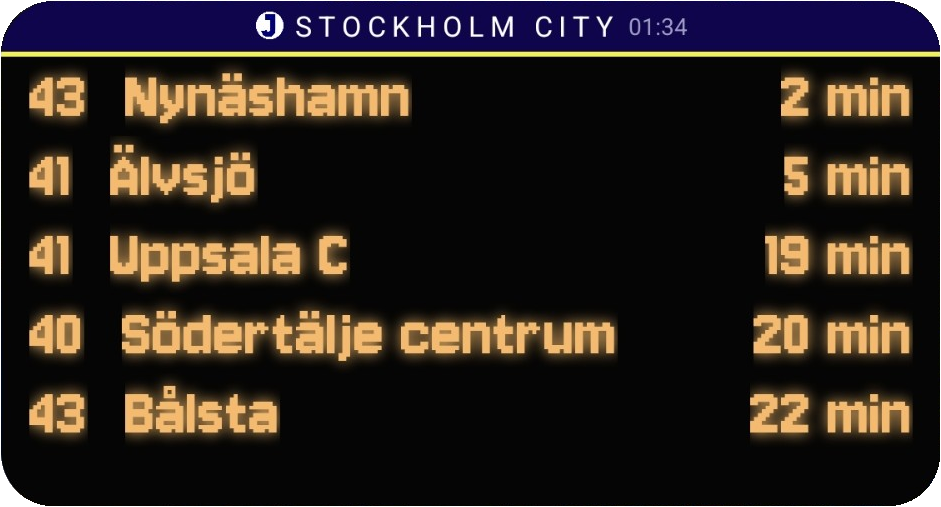
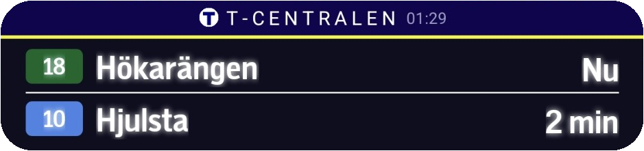
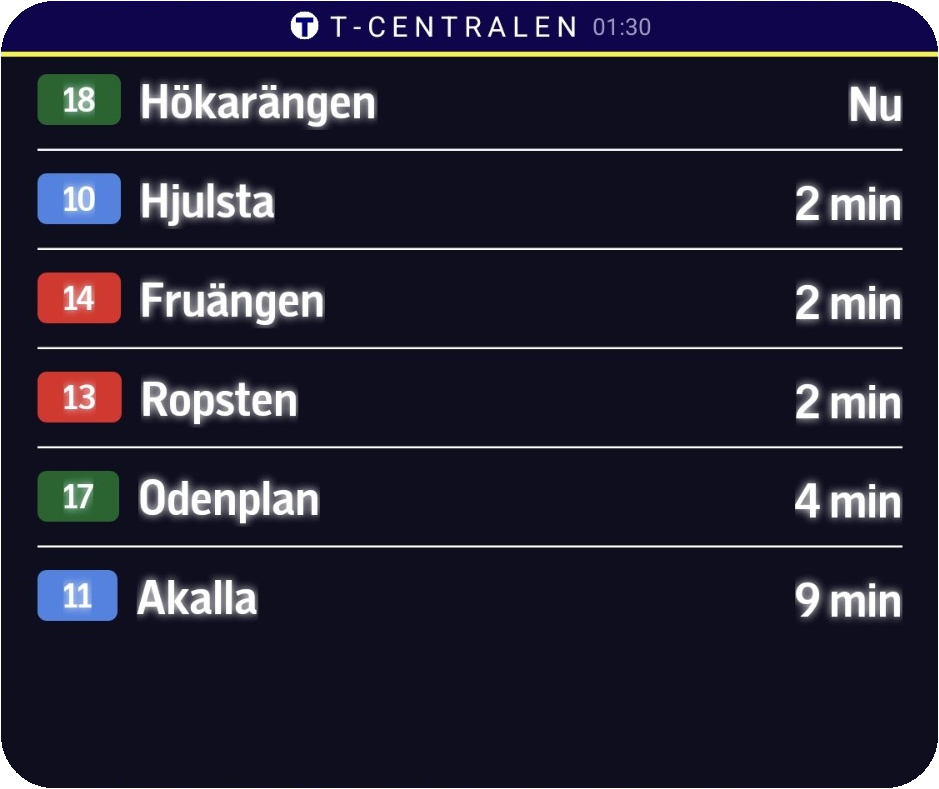
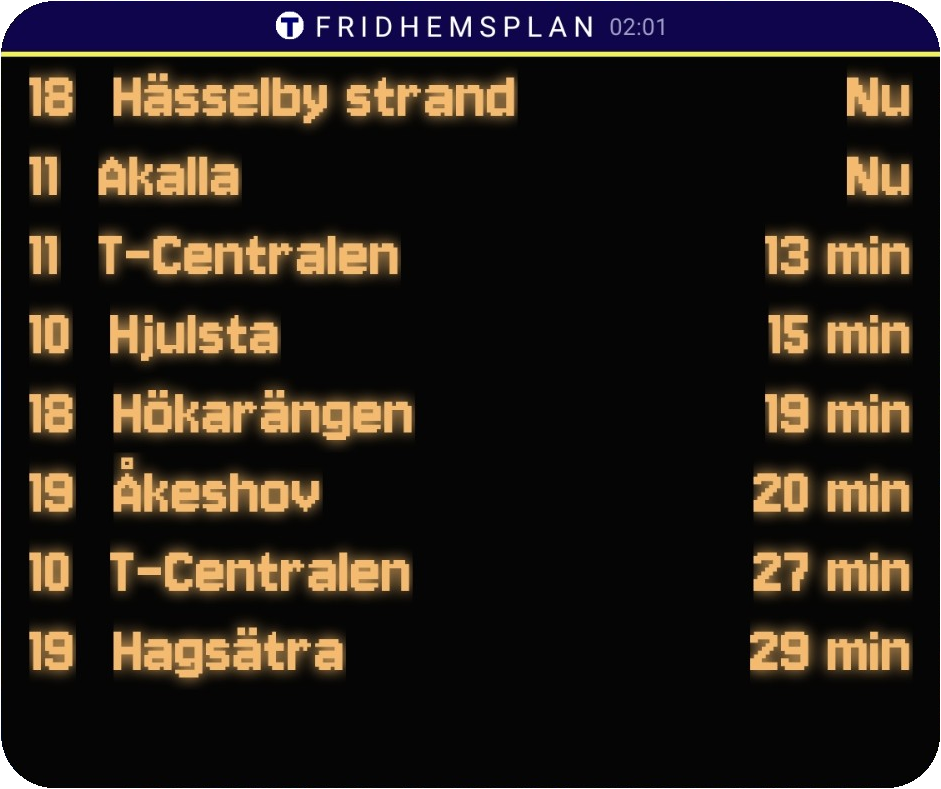
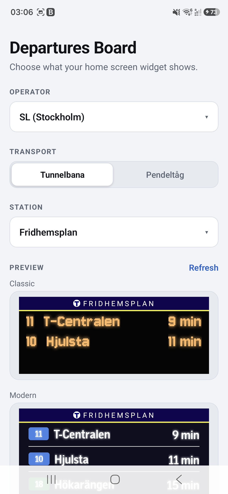
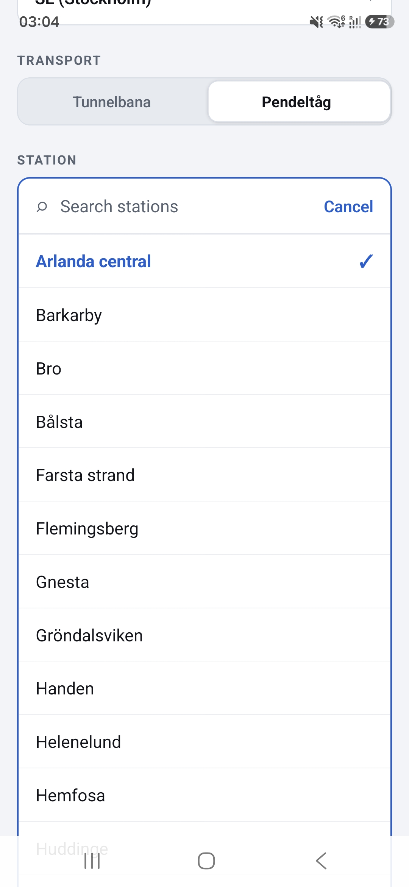
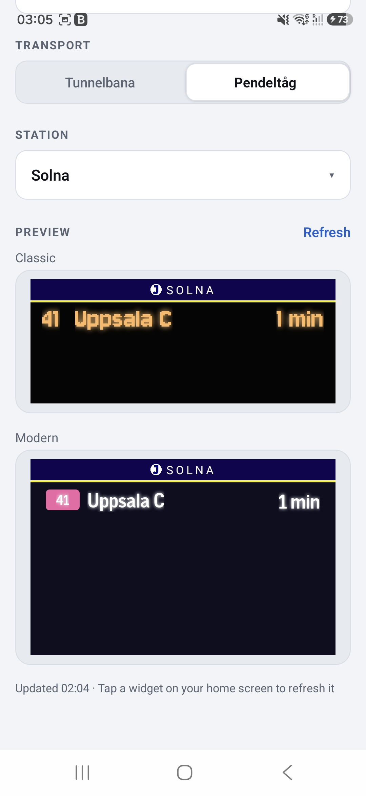

# Departures Board Widget

An Android home-screen widget experience for live public transport departures, built with Expo and React Native. This project turns real-time departure data into a glanceable, home-screen-first interface for commuters in Stockholm, with provider-aware board styling and a compact configuration app.

## Overview

The app lets a user choose a transit provider, station, and transport type, then displays current departures in a widget-friendly layout. It currently includes two custom Android widget variants:

- SL "Classic" board
- SL "Modern" board

The widget content is refreshed to match the user’s selected station and is designed to fit the constraints of a home-screen widget while preserving an attractive, information-dense layout.

This project was built to explore the intersection of:

- React Native + Expo for a lightweight native app shell
- Android widgets for home-screen utilities
- live transport data integration
- provider abstraction and pluggable board rendering
- mobile UX design for glanceable information

## Features

- Live departures for Stockholm public transport via a provider-based service layer
- Two branded Android widget variants with distinct visual identities
- Station and transport selection inside the app
- Persistent preferences for provider, transport, and stop selection
- Provider isolation with a clean abstraction for future transport operators
- Responsive widget sizing with auto-fit departure row counts
- Tapping a widget triggers a refresh flow for updated departures
- Type-safe data flow between service, app state, and widget rendering layers

## SL departure board widgets

For the SL provider, the project supports two branded widget styles: a classic board and a modern board. Both are resizeable and tuned for the commuter experience, with a station header that reflects the current line type such as T-Bana or Pendeltåg.

### Classic SL board

This version recreates the retro public-transit board aesthetic with a pixel-inspired display, strong station branding, and a compact departure list.



### Modern SL board

This variant uses a cleaner commuter-panel layout with stronger separation between line badges, destination names, and countdowns while keeping the same home-screen usability.



### Different board header for T-Bana / Pendeltåg
Header remains recognisable for transport type:

   <p align="center">
      
      
   </p>

### Resizeable widget behavior

The board adapts to different widget heights and widths without losing legibility, which makes it practical on Android home screens and gives the design a native utility-app feel. The same widget can be compact or tall depending on the user’s home-screen layout, while keeping the SL identity intact.

- Classic and modern variants both resize vertically
- Departure rows adjust to the available space so the list remains readable

- Compact layouts keep the most important information visible first
- Tapping the widget can trigger a refresh flow for updated departures

#### Resize examples

These screenshots show the same SL board family at different heights and densities, demonstrating how the layouts remain usable as the widget grows or shrinks.

   <div style="display: flex; flex-direction: row; column-gap: 5px">
      <div style="display: flex; flex-direction: column; width: 48%; row-gap: 10px;">
         
         
         
      </div>
      <div style="display: flex; flex-direction: column; width: 48%; row-gap: 10px;">
         
         
         
      </div>
   </div>

The practical result is a widget system that feels native to Android: compact enough for quick glanceability, but still rich enough to surface multiple departures and destination names when more space is available.

## In-App features for widget configuration

### Transport Provider / Type / Station configurator



### Station Selection



### Widget Preview



## Tech stack

- Expo SDK 56
- React Native 0.85
- Expo Router
- TypeScript
- Android widget support via react-native-android-widget
- SQLite for local persistence
- Custom native-like widget rendering and provider-driven theming

## Project structure

```text
.
├── app.json                 # Expo + Android widget configuration
├── src/
│   ├── app/                # App screens and routing
│   ├── components/         # Reusable UI primitives
│   ├── services/           # Transport provider and data access layer
│   ├── utils/              # Local storage helpers
│   └── widgets/            # Widget definitions and shared rendering logic
├── assets/                 # Icons, fonts, widget previews, etc.
├── android/                # Android project files
├── plugins/                # Expo config plugins
├── package.json
├── README.md
└── tsconfig.json
```

## How it works

1. The user selects a transport provider, stop, and travel mode in the app.
2. The app stores the selection locally so it survives future sessions.
3. The app fetches live departures from the active provider.
4. The widget is updated with the selected station and departure set.
5. Each widget variant renders board data according to its own design and sizing rules.

This separation keeps the widget layer focused on display while service logic handles provider-specific data and normalization.

## Product notes

This project is a strong demonstration of product-oriented mobile engineering:

- It is built around a real user scenario: checking departures in seconds
- It balances app and widget UX instead of treating them as separate concerns
- It demonstrates abstractions that make adding new providers or board styles straightforward
- It shows how technical design can support a clean, polished user experience

## Run locally

### Install dependencies

```bash
npm install
```

### Start the Expo dev server

```bash
npx expo start
```

### Run on Android

```bash
npm run android
```

### Start web preview

```bash
npm run web
```

## Useful commands

```bash
npm run start
npm run android
npm run web
npm run lint
```

## Future improvements

- Add support for additional transport providers
- Add richer error recovery and offline states
- Add a premium/high-contrast widget mode
- Add automated tests around provider logic and widget rendering
- Capture final screenshots and demo videos for portfolio publishing

## Portfolio summary

This project demonstrates a practical mobile product built to solve a daily-use problem with a strong home-screen presence. It combines data fetching, native widget integration, and polished UX into one cohesive experience—an ideal example of engineering work that feels useful beyond the app itself.

---

If you want, this README can be adapted for a more minimal "GitHub project" tone or a more premium portfolio style with a stronger personal brand and achievement framing.
